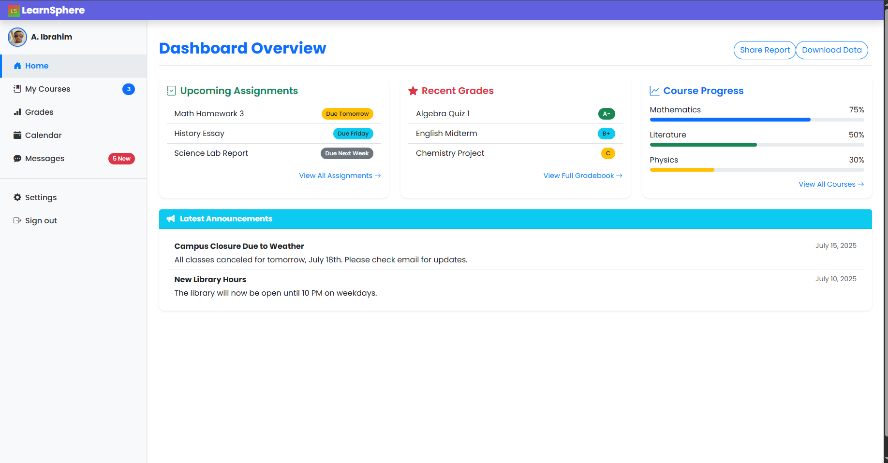

# LearnSphere 🎓

A comprehensive Django-based student dashboard simulating a real-life academic system.

## 🔍 Features

- Secure login & logout
- Dynamic student/instructor profiles
- Class schedules, grades, assignments, announcements
- Responsive Bootstrap 5 UI

## 📸 Screenshot



## ⚙️ Tech Stack

- Django
- Bootstrap 5
- PostgreSQL / SQLite
- HTML, CSS, JS

## 🚀 Run Locally

```bash
git clone https://github.com/your-username/your-repo.git
cd your-repo
python manage.py runserver
